# DFIR-Horcrux-Investigation
Digital forensics walkthrough of a Windows AD1 evidence image — registry analysis, browser forensics, and email investigation using EZTools, FTK Imager, and DB Browser for SQLite.


# 🔍 DFIR Walkthrough: Horcrux.ad1 Forensic Image Analysis

> **Difficulty:** Beginner–Intermediate  
> **Tools:** FTK Imager, Registry Explorer, DB Browser for SQLite, Kernel OST Viewer  
> **Image Type:** Custom Content Image (AD1)  
> **Examiner:** Minerva | **Acquired:** May 11, 2021

---

## 📋 Table of Contents

1. [What is an AD1 Image?](#what-is-an-ad1-image)
2. [Image Integrity Verification](#image-integrity-verification)
3. [What Was Collected?](#what-was-collected)
4. [Tool Setup](#tool-setup)
5. [Phase 1 — Registry Analysis](#phase-1--registry-analysis)
6. [Phase 2 — Browser Forensics](#phase-2--browser-forensics)
7. [Phase 3 — Email Analysis](#phase-3--email-analysis)
8. [Phase 4 — File System Artifacts](#phase-4--file-system-artifacts)
9. [All Answers Summarized](#all-answers-summarized)
10. [Key Takeaways](#key-takeaways)

---

## What is an AD1 Image?

Unlike a full disk image (E01), an **AD1 (Custom Content Image)** is a selective forensic image — it captures only specific folders and files rather than an entire drive. This makes it smaller and faster to work with, but means some artifacts (like NTUSER.DAT) may not be present if they weren't in scope.

The `Horcrux.ad1` image was created with **AccessData FTK Imager 4.2.1.4** and contains:

| Collected Path | Why It Matters |
|---|---|
| `Windows\System32\config\*` | Windows Registry hives (SAM, SYSTEM, SOFTWARE) |
| `Users\Karen\AppData\Local\Google\*` | Chrome browser data |
| `Users\Karen\AppData\Local\Microsoft\Outlook\*` | Outlook email archive |
| `Users\Karen\AppData\Roaming\Microsoft\Office\*` | Office recent files & LNK files |
| `Partition 3 [PacaLady]\*` | Second NTFS partition |

> **Why not NTUSER.DAT?** It lives at `Users\Karen\NTUSER.DAT` — a path not included in the custom content scope. We must rely on the other artifacts instead.

---

## Image Integrity Verification

Before any analysis, **always verify the hash values**. A matching hash proves the image hasn't been altered since acquisition.

```
MD5:  562ea531434f34bc202b349b3d5f8051  ✅ VERIFIED
SHA1: 6f23af0de52b19be2f12ee148dc2384f535fd781  ✅ VERIFIED
```

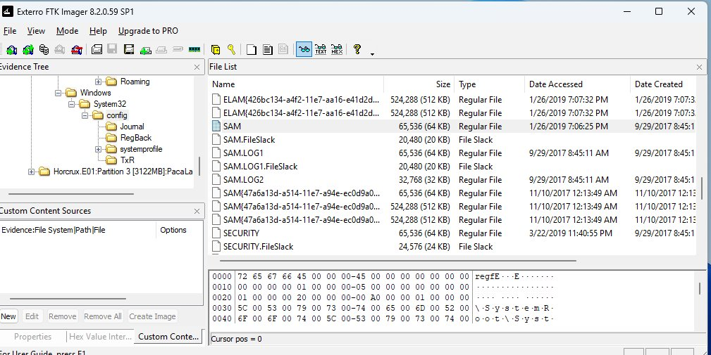
*FTK Imager — SAM hive and registry config folder*

---

## Tool Setup

| Tool | Download | Purpose |
|---|---|---|
| **FTK Imager** | [exterro.com](https://www.exterro.com/ftk-imager) | Mount & browse the AD1 image |
| **Registry Explorer** | [ericzimmerman.github.io](https://ericzimmerman.github.io/) | Parse registry hives |
| **DB Browser for SQLite** | [sqlitebrowser.org](https://sqlitebrowser.org/) | Query Chrome databases |
| **Kernel OST Viewer** | [nucleustechnologies.com](https://www.nucleustechnologies.com/) | Read Outlook OST files |

---

## Phase 1 — Registry Analysis

The Windows Registry is a goldmine for forensic investigators. Three hives were available in this image, each answering different questions.

### Loading Hives in Registry Explorer

1. In FTK Imager, navigate to `Partition 2 > [root] > Windows > System32 > config`
2. Right-click `SAM`, `SYSTEM`, `SOFTWARE` → **Export Files**
3. Open **Registry Explorer** → `File > Load Hive` → load each file

---

### 🔑 SAM Hive — User Accounts

**Path:** `SAM\Domains\Account\Users`

The SAM (Security Account Manager) hive stores all local user accounts, their password hashes, and account metadata.

**Why SAM?** It's the only place that stores local Windows user accounts and their group memberships. No other hive has this information.

Navigate to: `SAM > Domains > Account > Users > Names`

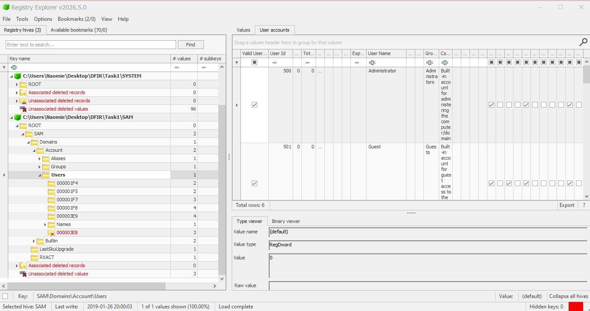
*SAM Hive — User Accounts tab: Administrator, Guest, DefaultAccount, WDAGUtilityAccount visible*

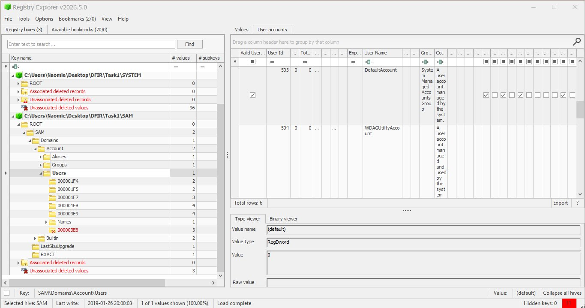
*SAM Hive — User Accounts tab continued*

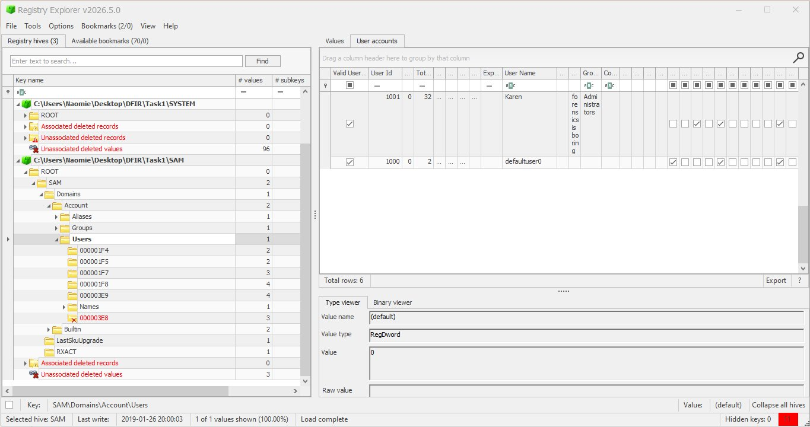
*SAM Hive — Karen (User ID 1001) listed as member of Administrators group*

**✅ Finding: Administrator username = `Karen`**

| User ID | Username | Group |
|---|---|---|
| 500 | Administrator | Administrators (built-in, disabled) |
| 501 | Guest | Guests |
| **1001** | **Karen** | **Administrators** ← active admin |
| 1000 | defaultuser0 | — |

#### Password Last Changed

Navigate to `Users > 000003E9` (Karen's User ID 1001 in hex = 0x3E9):

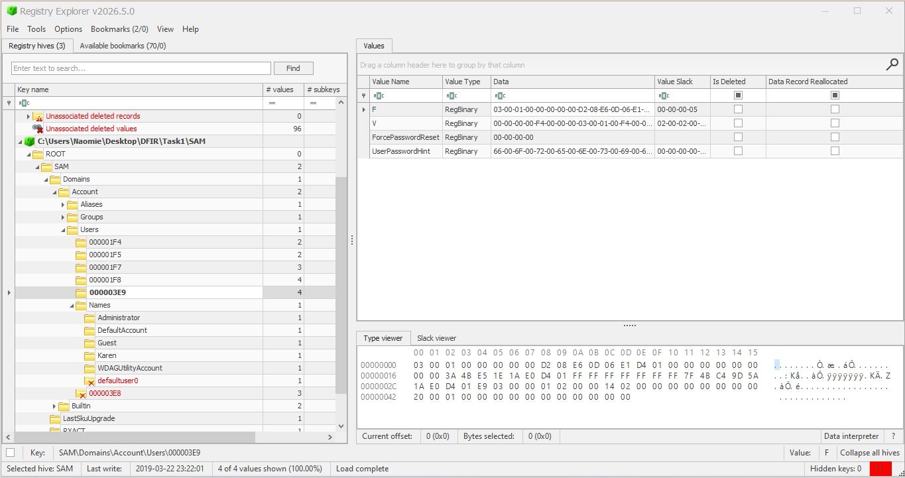
*SAM Hive — 000003E9 key showing Karen's account values (F, V, ForcePasswordReset)*

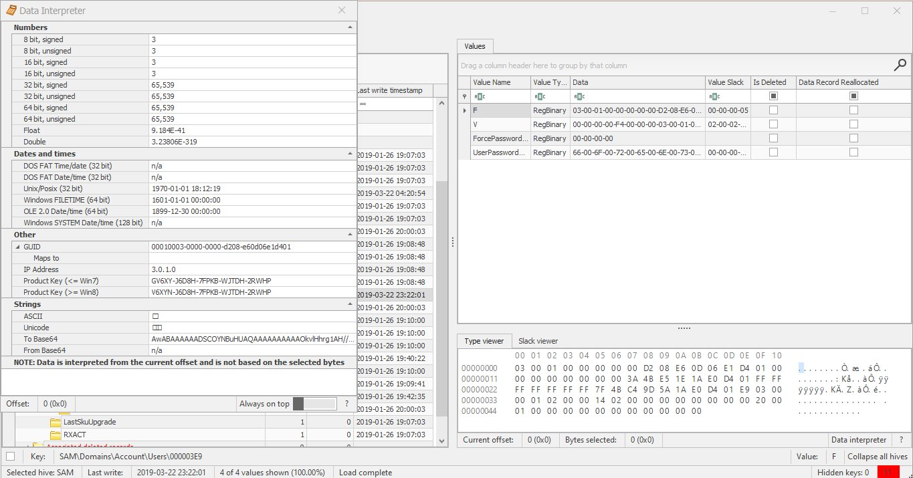
*Data Interpreter decoding Karen's account binary — Last write timestamp = 2019-03-22 23:22:01*

**✅ Finding: Password last changed = `2019-03-22 23:22:01`**

> **Why hex?** User IDs in the SAM are stored as hexadecimal. 1001 decimal = 0x3E9, so Karen's folder is named `000003E9`.

---

### 🔑 SYSTEM Hive — Machine Configuration

**Why SYSTEM?** The SYSTEM hive stores hardware configuration, services, and machine-level settings. It's the authoritative source for hostname and timezone — both machine-wide settings that don't belong to any individual user.

#### Hostname

**Path:** `ControlSet001\Control\ComputerName\ComputerName`

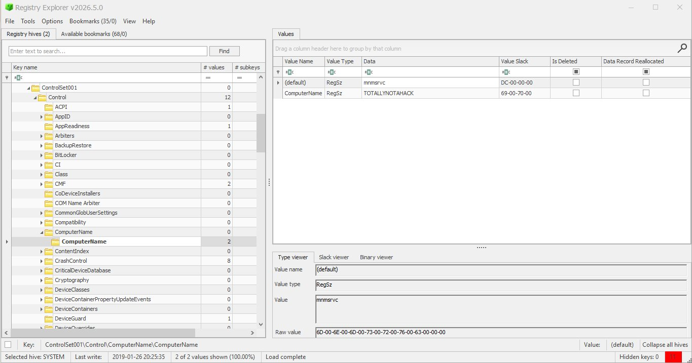
*SYSTEM Hive — ComputerName key showing TOTALLYNOTAHACK*

**✅ Finding: Hostname = `TOTALLYNOTAHACK`**

#### Timezone

**Path:** `ControlSet001\Control\TimeZoneInformation`

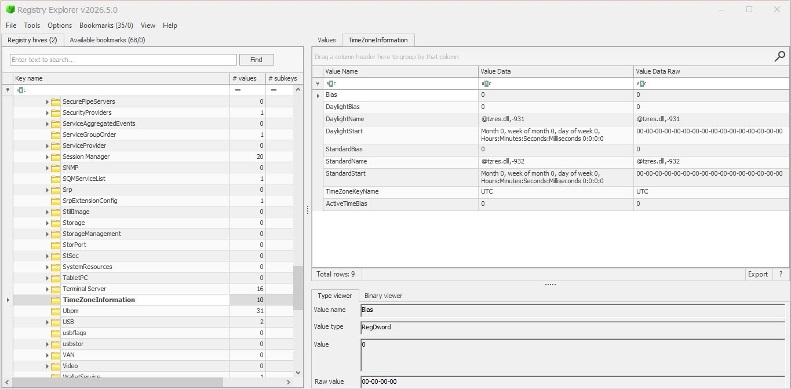
*SYSTEM Hive — TimeZoneInformation showing TimeZoneKeyName = UTC, Bias = 0*

**✅ Finding: Timezone = `UTC`**

---

### 🔑 SOFTWARE Hive — OS Build Number

**Path:** `Microsoft\Windows NT\CurrentVersion`

**Why SOFTWARE?** The SOFTWARE hive contains OS installation details and registered applications. `CurrentVersion` is where Windows stores its own build metadata — not in SYSTEM or SAM.

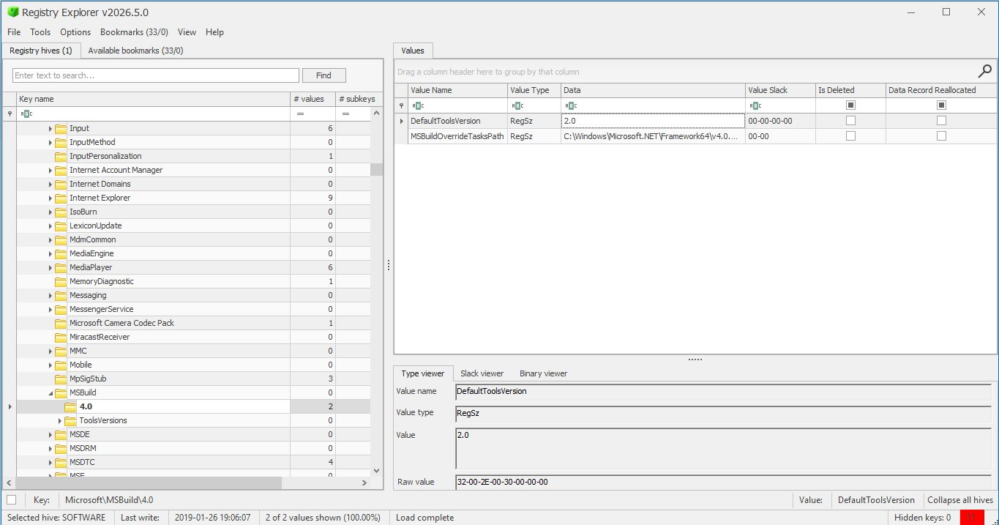
*SOFTWARE Hive — Before navigating to CurrentVersion (in MSBuild key)*

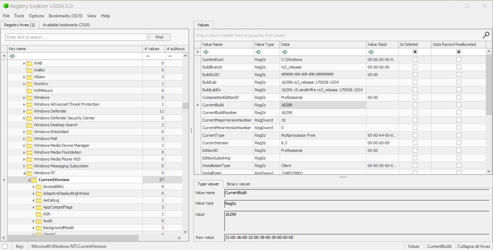
*SOFTWARE Hive — Windows NT\CurrentVersion: CurrentBuild = 16299, Windows 10 Pro*

**✅ Finding: OS Build Number = `16299`** (Windows 10 Fall Creators Update, v1709)

---

## Phase 2 — Browser Forensics

Chrome stores browsing history, downloads, and form data in **SQLite databases** inside the user's AppData folder.

### Extracting Files from FTK Imager

Navigate to:
```
Partition 2 > [root] > Users > Karen > AppData > Local > Google > Chrome > User Data
```

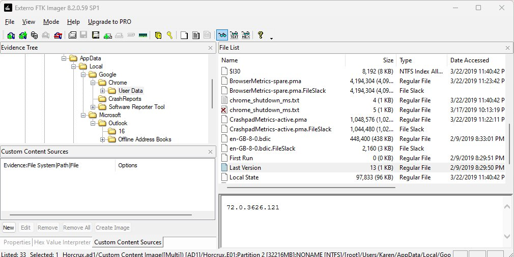
*FTK Imager — Chrome User Data folder. Note: Last Version file preview shows 72.0.3626.121*

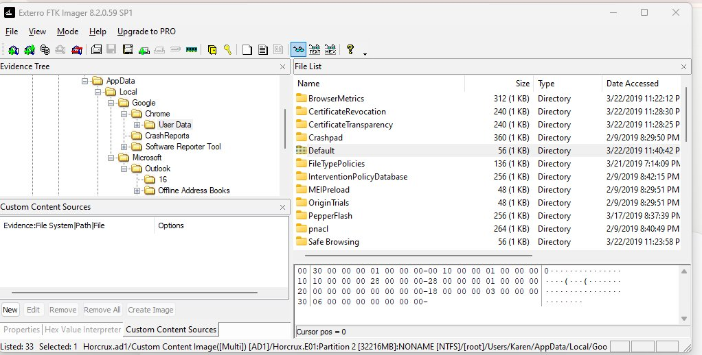
*FTK Imager — User Data contents showing Default folder (contains History file)*

**✅ Finding: Chrome Version = `72.0.3626.121`** (from Last Version file plaintext)

### Opening Chrome History in DB Browser

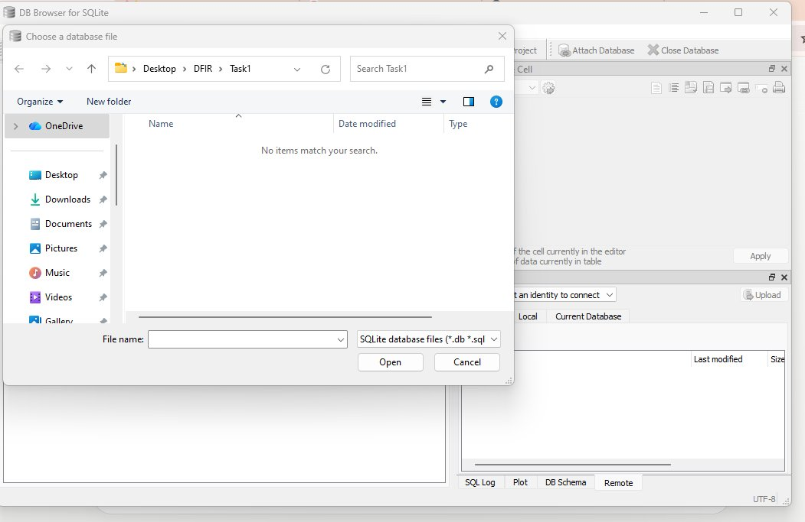
*DB Browser for SQLite — Change file filter to "All Files" to load the Chrome History file (no extension)*

### Skype Download URL, Messaging App & Second Partition

```sql
SELECT target_path, tab_url
FROM downloads
WHERE tab_url LIKE '%skype%';
```

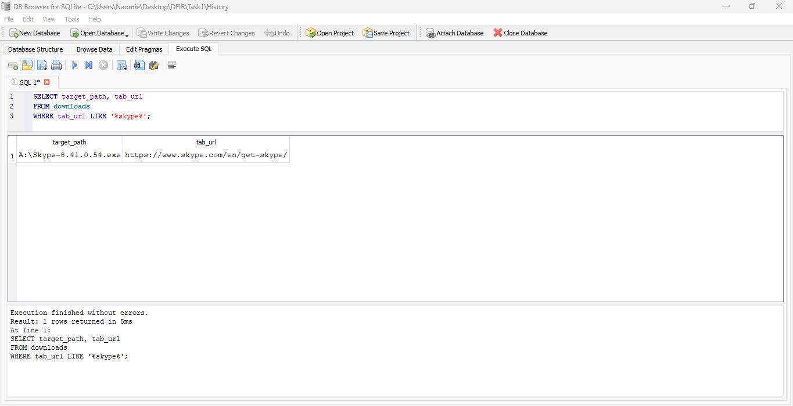
*DB Browser — downloads table: target_path = A:\Skype-8.41.0.54.exe, tab_url = https://www.skype.com/en/get-skype/*

**✅ Finding: Messaging App = `Skype`**  
**✅ Finding: Skype Download URL = `https://www.skype.com/en/get-skype/`**  
**✅ Finding: Second Partition Letter = `A:\` (PacaLady)** — revealed by the download path

### AlpacaCare.docx Domain

```sql
SELECT url, title, last_visit_time
FROM urls
WHERE url LIKE '%alpaca%' OR title LIKE '%alpaca%';
```

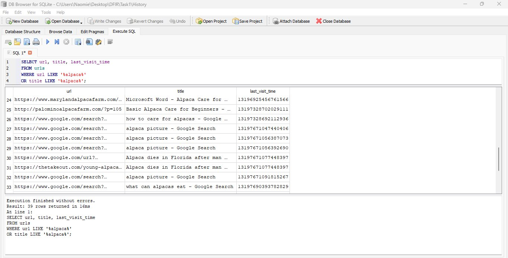
*DB Browser — urls table filtered for alpaca: row 24 shows marylandalpacafarm.com with title "Microsoft Word - Alpaca Care for..."*

**✅ Finding: AlpacaCare.docx domain = `www.marylandalpacafarm.com`**

### Admin Zip Code (Web Data database)

Export the `Web Data` file from the same Default folder, open in DB Browser, browse the `autofill` table:

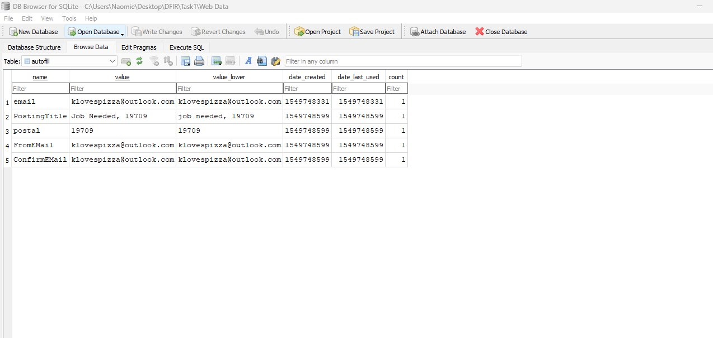
*DB Browser — Web Data autofill table: postal = 19709, PostingTitle = "Job Needed, 19709"*

**✅ Finding: Admin Zip Code = `19709`**

---

## Phase 3 — Email Analysis

The Outlook OST file contains all of Karen's email correspondence. Export from:
```
Karen > AppData > Local > Microsoft > Outlook > klovespizza@outlook.com.ost
```
Open with **Kernel OST Viewer**.

### First Contact from TAAUSAI

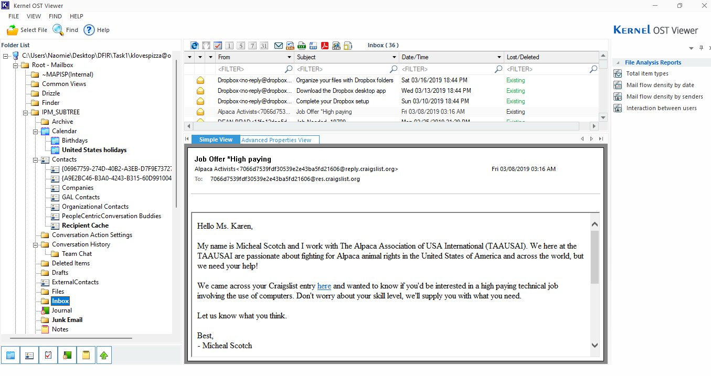
*Outlook OST — First email from Micheal Scotch / TAAUSAI: "Job Offer *High paying"*

**✅ Finding: TAAUSAI contact initials = `M.S.` (Micheal Scotch)**

### Money Offered

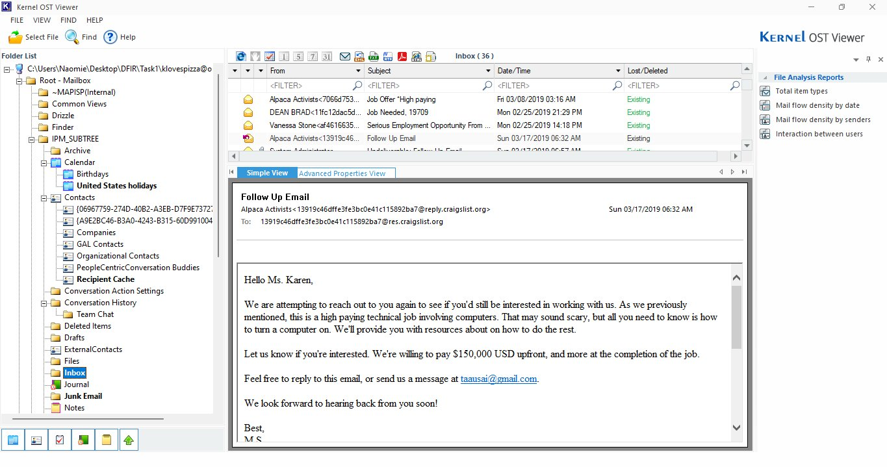
*Outlook OST — Follow Up Email: "We're willing to pay $150,000 USD upfront..."*

**✅ Finding: Money offered upfront = `$150,000 USD`**

### Manager's Test Question (Base64 Challenge)

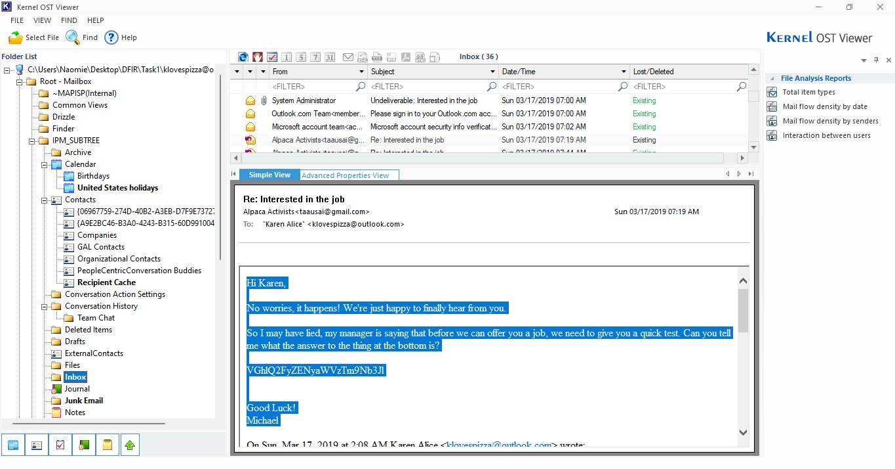
*Outlook OST — Manager's test email containing Base64 string VGhlQ2FyZENyaWVzTm9Nb3Jl*

Decode the Base64 string:
```
VGhlQ2FyZENyaWVzTm9Nb3Jl  →  TheCaryCriesNoMore
```

**✅ Finding: Answer to manager's question = `TheCaryCriesNoMore`**

### Job Position Confirmed

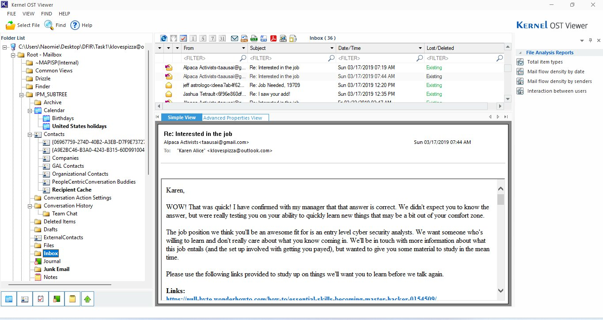
*Outlook OST — TAAUSAI confirms Karen passed the test, offers "entry level cyber security analysts" position*

**✅ Finding: Job position offered = `Entry Level Cyber Security Analyst`**

### Meeting Country

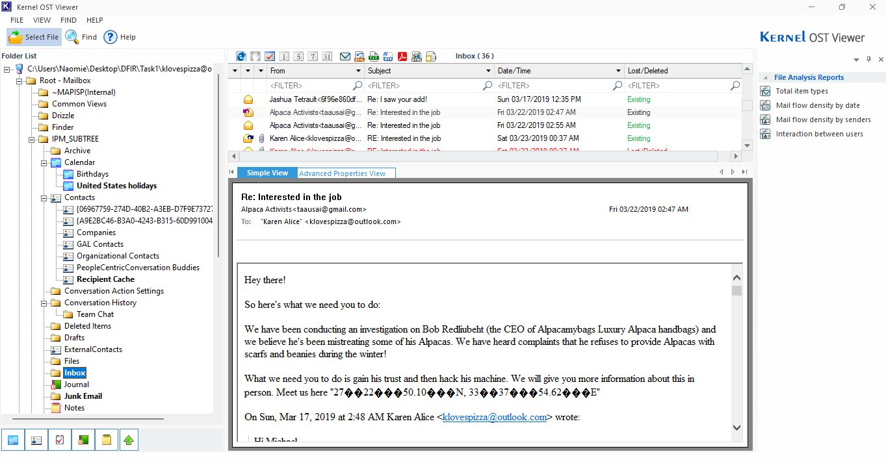
*Outlook OST — Email with GPS coordinates: 27°22'50.10"N, 33°37'54.62"E → Egypt (Red Sea coast)*

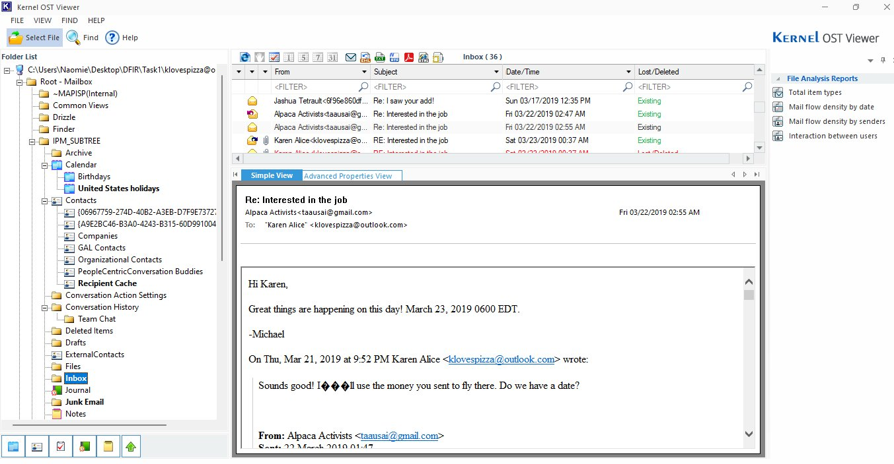
*Outlook OST — Follow-up confirming meeting date: March 23, 2019 at 0600 EDT*

**✅ Finding: Meeting country = `Egypt`**

---

## Phase 4 — File System Artifacts

### AlpacaCare.docx Last Accessed — LNK Files

**LNK files** (Windows shortcut files) are automatically created by Windows when a user opens a document. They record the last access timestamp of the original file — extremely useful when the actual document isn't present in the image.

**Location:** `Karen > AppData > Roaming > Microsoft > Office > Recent`

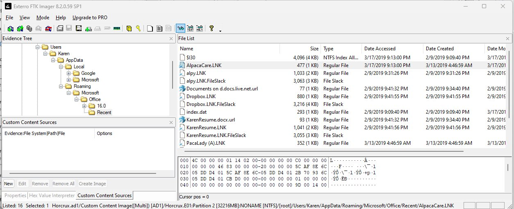
*FTK Imager — Office\Recent folder: AlpacaCare.LNK Date Accessed = 3/17/2019 9:13:00 PM*

**✅ Finding: AlpacaCare.docx last accessed = `3/17/2019 9:13:00 PM`**

> **Why LNK files?** Since NTUSER.DAT wasn't included in the AD1, we couldn't check the RecentDocs registry key. LNK files in the Office Recent folder are the next best source for document access timestamps.

---

## All Answers Summarized

| # | Question | Answer | Tool | Source |
|---|---|---|---|---|
| 1 | Administrator's username | **Karen** | Registry Explorer | SAM Hive |
| 2 | OS Build Number | **16299** | Registry Explorer | SOFTWARE Hive |
| 3 | Hostname | **TOTALLYNOTAHACK** | Registry Explorer | SYSTEM Hive |
| 4 | Messaging application | **Skype** | DB Browser for SQLite | Chrome History (downloads) |
| 5 | Admin zip code | **19709** | DB Browser for SQLite | Chrome Web Data (autofill) |
| 6 | TAAUSAI contact initials | **M.S.** (Micheal Scotch) | Kernel OST Viewer | Outlook OST |
| 7 | Money offered upfront | **$150,000 USD** | Kernel OST Viewer | Outlook OST |
| 8 | Meeting country | **Egypt** | Kernel OST Viewer | Outlook OST |
| 9 | Machine timezone | **UTC** | Registry Explorer | SYSTEM Hive |
| 10 | AlpacaCare.docx last accessed | **3/17/2019 9:13:00 PM** | FTK Imager | LNK File |
| 11 | Second partition letter | **A:\\** (PacaLady) | FTK Imager + Chrome History | AD1 Manifest + downloads |
| 12 | Manager's question answer | **TheCaryCriesNoMore** | Base64 Decoder | Outlook OST (decoded) |
| 13 | Job position offered | **Entry Level Cyber Security Analyst** | Kernel OST Viewer | Outlook OST |
| 14 | Password last changed | **2019-03-22 23:22:01** | Registry Explorer | SAM Hive |
| 15 | Chrome version | **72.0.3626.121** | FTK Imager | Chrome Last Version file |
| 16 | Skype download URL | **https://www.skype.com/en/get-skype/** | DB Browser for SQLite | Chrome History (downloads) |
| 17 | AlpacaCare.docx website domain | **www.marylandalpacafarm.com** | DB Browser for SQLite | Chrome History (urls) |

---

## Key Takeaways

### Why Each Hive Was the Best Source

| Hive | Why It Was Used |
|---|---|
| **SAM** | Only place storing local user accounts, password timestamps, and group membership — no other hive has this |
| **SYSTEM** | Authoritative source for machine-level config: hostname, timezone, drive letters — machine-wide, not user-specific |
| **SOFTWARE** | Stores OS build metadata and installed application records — `Windows NT\CurrentVersion` is the canonical OS version key |

### Forensic Lessons Learned

**AD1 vs Full Disk:** A custom content image only contains what the examiner collected. Always read the manifest first before searching for artifacts that may not be present.

**Chrome History is powerful:** One SQLite file reveals browsing history, downloads, searches, and form data — crossing into identity, activity timeline, and communication evidence.

**LNK files fill registry gaps:** When NTUSER.DAT is unavailable, Office LNK files in AppData\Roaming provide reliable last-access timestamps for recently opened documents.

**Emails tell the whole story:** The Outlook OST file contained the entire narrative — who Karen communicated with, what job she was offered, the hacker group's plan, and the meeting location.

**Base64 in the wild:** Forensic investigators sometimes encounter encoded data in emails or files. Always try common encodings (Base64, hex, ROT13) when you see suspicious strings.

---

*Written for educational purposes as part of a DFIR course assignment.*  
*All tools used are industry-standard and freely or freely available for download.*

> **Note for GitHub:** Place all screenshot PNG files in a `screenshots/` subfolder alongside this README for images to render correctly.

